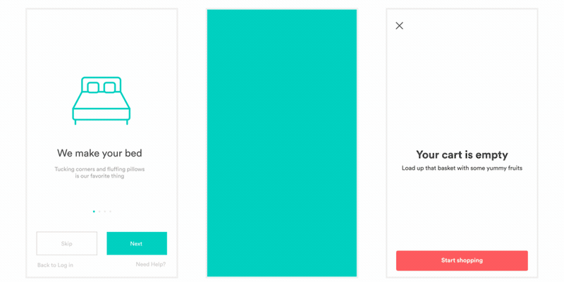
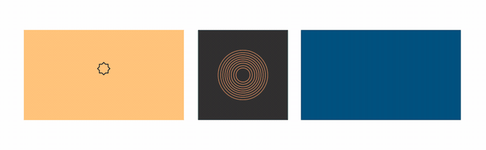

# Sample Lottie for Android

All of these animations were created in After Effects, exported with [Bodymovin](https://github.com/bodymovin/bodymovin), and rendered natively with no additional engineering effort.
